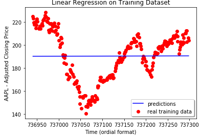
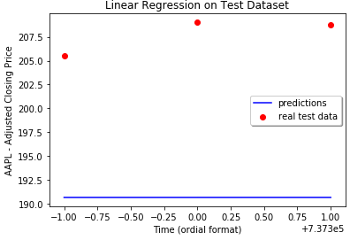
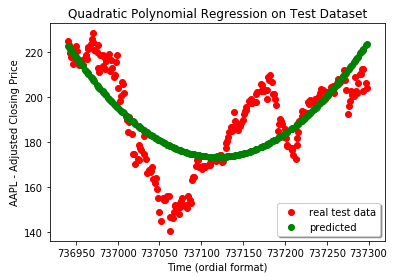
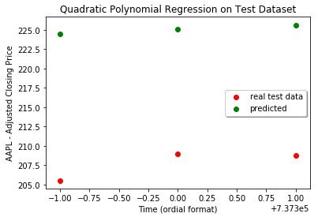
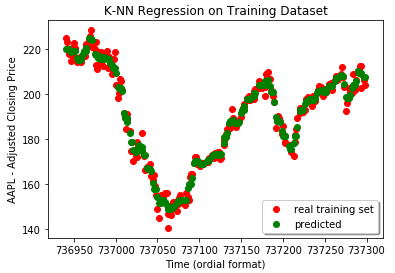
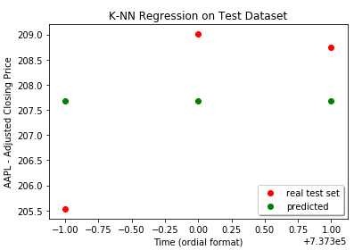

# Stock Price Prediction

__Description__: consider 3 different types of regression lines to predict stock prices using Python, then make a conclusion which model performs the best.

---

## Prerequisites

Download Historical Stock Price Data
Go to Yahoo Finance and find a stock price that you want to predict. Click on historical data, then download the CSV of that stocks price history. Example: https://finance.yahoo.com/quote/AAPL/history?p=AAPL 
Save the CSV file to the same directory where the Python script ""

---

We will split the data set into the Training set and Test set, taking 1% of the initial data set use as a Test set.

Note: the "Date" feature values of the data set have been converted from the type "str" to the proleptic Gregorian ordinal of the date, (where January 1 of year 1 has ordinal 1) to make it easier to build ML models.

---

## 1. Simple Linear Regression Model (SLR)

After training the SLR model on the Training Set, let's visualize how the model performs on the same Training Set:

Well, this is kind of expected - it is a average trend.

Now, lets see how the SLR model performs on the unknow Test Set:

Very inaccurate, but expected for Simple Linear Regression Model on a complex non-linear data set.
Which tells us not to use Simple Linear Regression for Stock Price prediction.

---

## 2. Quadratic Polynomial Regression Model (QPR)

After training the QPR model on the Training Set, let's visualize how the model performs on the same Training Set:

Definitely, better comparing to the Simple Linear Regression, but still not usable.
To confirm, we will visualize performance of Quadratic Polynomial Regression Model on the Test Data Set:

No, we cannot trust this model.

---

## 3. K-Nearest Neighbor (K-NN) Model 

After training the K-NN model on the Training Set, let's visualize how the model performs on the same Training Set:

Oh, finally!
Let's verify how well the K-NN model does on the Test Set:

This is quite accurate.

---

## Conclusion

Between the tree regression models we considered, only the K-Nearest Neighbor (K-NN) Model is usable for stock price predictions.
